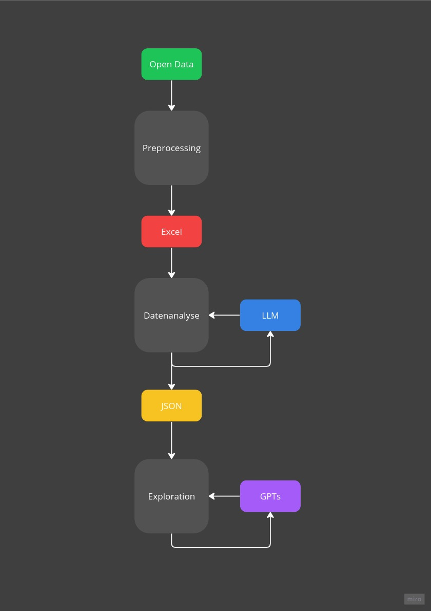

# Open Data Hackathon Challenge parlerment

## Open Data Hack St.Gallen 2023

### README Verzeichnis
- [/analyse/README.md](analyse/README.md)
- [/completion/README.md](completion/README.md)
- [/webapp/README.md](completion/README.md)

### Ausgangslage
Auf der Open-Data-Plattform der Stadt St.Gallen liegt ein Datensatz mit den Geschäften aus dem St.Galler Stadtparlament. Darin aufgeführt sind etwa der Titel des einzelnen Vorstosses, welche Poltiker:in ihn eingereicht hat, und welche Partei dadurch dahinterstand.

Über den Datensatz sind zu jedem Geschäft die dazugehörigen Dokumente downloadbar. Bei Vorstössen etwa der jeweilige Vorstoss und die Antwort des Stadtrates darauf. Die Dokumente liegen als PDFs in einem Zip-Ordner vor.

An einem früheren Hackathon haben Studierende der Fachhochschule OST einen Code geschrieben, der den Volltext jedes Dokuments ausliest und dem jeweiligen Geschäft hinzufügt. Es wurde ausserdem versucht, jedem Geschäft ein Thema zuzuordnen, was aber nicht verlässlich gelang.

Um das volle Potenzial des Datensatzes ausreizen zu können, ist das jedoch nötig. Gerade vor Wahlen könnte der Datensatz so Einsichten liefern, für welche Themen sich welche Parteien wie stark einsetzen.

Aus diese Grund wurde diese Aufgabe als [Challenge](https://www.opendatahacksg.ch/_files/ugd/adb50b_7bfd538275324429bdd7495a38ad06f9.pdf) am Open Data Hack St.Gallen eingereicht.

### Datenquellen
[Datensatz Parlamentsgeschäfte](https://daten.sg.ch/explore/dataset/traktandierte-geschaefte-sitzungen-stadtparlament-stgallen%40stadt-stgallen/table/?disjunctive.legislatur&disjunctive.geschaeftstyp&disjunctive.gliederung&disjunctive.gliederungsnummer&disjunctive.ebene1&disjunctive.ebene2&disjunctive.ebene3&disjunctive.ebene4&disjunctive.ebene5&disjunctive.ebene6&disjunctive.traktandenstatus&sort=nr&refine.legislatur=01.01.2021+-+31.12.2024)

- Ein Datensatz auf der Open-Data-Plattform der Stadt St.Gallen: "Traktandierte Geschäfte in Sitzungen des Stadtparlaments St.Gallen (RIS – Ratsinformationssystem)". Der Datensatz enthält auch Links zu den Sitzungsprotokollen des Stadtparlaments.

- Eine Kaggle-Competition (kaggle.com/competitions/male-stgallen-recommender) mit einer detaillierten Problembeschreibung.

- Code von Studierenden (bei Beat Tödtli beziehbar). Der Code ermittelt eine Vorhersage des Themas aufgrund der Titel der Geschäfte und den Kategorien aus dem Aktenplan. Das Machine Learning Modell muss jedoch weiterentwickelt werden, um die Verlässlichkeit bedeutend zu erhöhen.

### Ziel
Für jedes einzelne Geschäft sollen dem Datensatz dessen wichtigsten Themen hinzugefügt werden. So sollen Auswertungen möglich werden wie zum Beispiel:

* Wie oft hat sich das Stadtparlament mit dem Thema X beschäftigt?
* Welche Themen waren im Jahr Y, im Zeitraum Z besonders wichtig?
* Wie hat sich die Themenkonjunktur über die Jahre/Jahrzehnte entwickelt?
* Welche Parteien/Fraktionen widmeten sich welchen Themen? Und wie hat sich das verändert?
* Interessiert sich die SP vor allem für schulische Themen und die FDP vor allem für
Finanzthemen?
* Worüber wird im Stadtparlament kaum je diskutiert?
* Sind klimapolitische Themen seit Fukushima stärker auf der Agenda als davor?

Der Code, um solche Auswertungen möglich zu machen, soll in einer Form vorliegen, dass er weiterentwickelt werden kann. Marlen Hämmerli, Datenjournalistin beim "St.Galler Tagblatt" und Challengeownerin möchte mit dem Code weiterarbeiten und ihn auch weiter entwickeln.

In einem zweiten Schritt stand es dem Team offen, ein Tool/Dashboard zu bauen. Dadurch sollte es der breiten Öffentlichkeit - und damit der Wählerschaft - möglich werden, eigene Analysen vorzunehmen.

### Vorgehen

1. Llama wurden Themen vorgegeben und die KI angewiesen, jedem Geschäft das passende zuzuordnen. So wurde der Datensatz mit Hilfe bekannter Tools (pandas) erweitert.
2. Die Volltexte wurden nach Quartiernamen durchsucht, um so festzustellen, welche Geschäfte welchem Quartier zugeordnet werden können. (Oder nicht.) Auf diese Art wurde der Datensatz erweitert.
3. Mit ChatGPT-4 wurden ebenfalls Themen abgefragt, aber auch Prompts mitgegeben wie z.B. "Wie links oder rechts ist Vorstoss X?"
4. ChatGPT wurde mit den Datensätzen trainiert mit dem Ziel, die KI in einem Dashboard einzubetten.
5. Mit Power BI wurden Visualisierungen erstellt.
6. Ein Dashboard wurde erstellt, in das die genannten Ergebnisse einflossen.

## Limitationen
Bei der Auswertung wurde nur auf die Vorstösse konzentriert. Jedem Vorstoss sind jedoch zwei Dokumente beigelegt. Neben jenem vom Parlament, auch jenes vom Stadtrat. Diese konnten nicht aus dem Datensatz gefiltert werden, flossen also in die Auswertung ein.

## Prozess Architektur

## Mögliche Weiterentwicklungen
Die Integration von ChatGPT.

## Team
- Marlen (marlen.haemmerli@tagblatt.ch)
- Raquel (raquel.kehl@ost.ch)
- Beat (beat.toedtli@ost.ch)
- Orhan (orhan.saeedi@bs.ch)
- Till
- Tobias (tobidex@gmx.de)
- Simon

